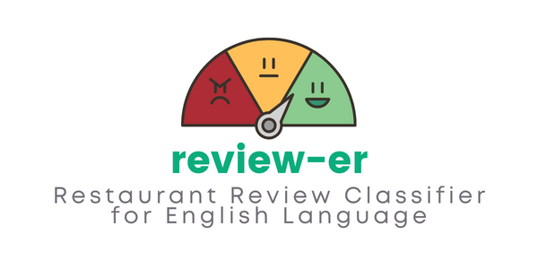

<p align="center">
  
</p>

This program provides you a trained logistic regression model to classify restaurant's English reviews if they are positive or negative.

<br>
```bash
~$ python3 classifer.py -r "Put here the review you want to classify."
```

## Installing
1. Clone the repository.
2. Install the requirements. (`pip3 install -r requirements.txt`)
3. Run the `classifer.py` script as the example above.
4. The output will be either "Positive" or "Negative".

## Training on Custom Dataset
Natural Language Processing based on binary logistic regression can be trained on custom dataset by using `nlp_trainer.py` script in `models` directory. Please refer to the [TRAIN.md](docs/train.md) file.

## Contributing
Please read [CONTRIBUTING.md](docs/CONTRIBUTING.md) for details on our code of conduct, and the process for submitting pull requests to us.

## License
This project is licensed under the MIT License - see the [LICENSE](docs/LICENSE) file for details.
